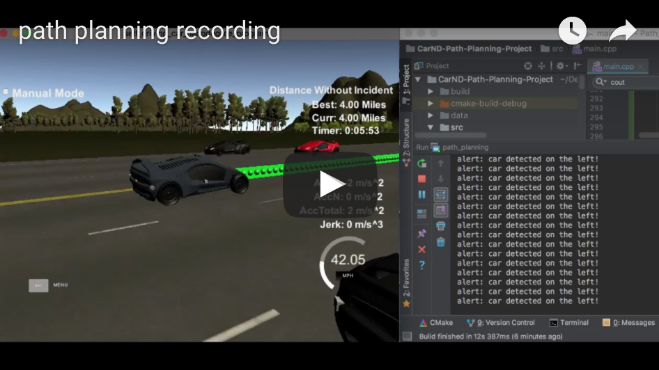

**Model Documentation**

The goal of the path planner is to create smooth and safe trajectories for the ego car to follow while driving on a highway simulator with other vehicles of various speeds.  The implementation of this project is largely based on the video walk-through in the Udacity classroom.  

Here is a video recording of the simulator controlled by the project code:

[](https://youtu.be/asCm5Y6VBpo)


Here is the discussion of the model used in the project.

The velocity of the ego car is initialized set to 0.0 mph. 

```
    double ref_vel = 0.0; //mph
```

The speed limit of our highway is 50.0 mph, so we increment the speed of the ego car if it is under 49.5 mph by 0.5 mph (0.5 mph is roughly 0.224 meter per second.)  

```
	if (ref_vel < 49.5) {
   		ref_vel += 0.224;
   }
```

The trajectory was created using spline.  We use five points to create the spline: two points near the current car position:

```

                    // if previous size is almost empty, use the car as starting reference
                    if (prev_size < 2) {
                        // Use two points that make the path tangent to the car
                        double prev_car_x = car_x - cos(car_yaw);
                        double prev_car_y = car_y - sin(car_yaw);

                        ptsx.push_back(prev_car_x);
                        ptsx.push_back(car_x);

                        ptsy.push_back(prev_car_y);
                        ptsy.push_back(car_y);

                    } else {
                        // use the previous path's end points as starting reference

                        ref_x = previous_path_x[prev_size-1];
                        ref_y = previous_path_y[prev_size-1];

                        double ref_x_prev = previous_path_x[prev_size-2];
                        double ref_y_prev = previous_path_y[prev_size-2];
                        ref_yaw = atan2(ref_y-ref_y_prev, ref_x-ref_x_prev);

                        // use two points that make the path tangent to the previous path's end point
                        ptsx.push_back(ref_x_prev);
                        ptsx.push_back(ref_x);

                        ptsy.push_back(ref_y_prev);
                        ptsy.push_back(ref_y);

                    }
```

and three points spacing 30m apart further away from the car's current position:  

```
                   // In Frenet add evenly 30m spaced points ahead of the starting reference
                    vector<double> next_wp0 = getXY(car_s+30,(2+4*lane),map_waypoints_s,map_waypoints_x,map_waypoints_y);
                    vector<double> next_wp1 = getXY(car_s+60,(2+4*lane),map_waypoints_s,map_waypoints_x,map_waypoints_y);
                    vector<double> next_wp2 = getXY(car_s+90,(2+4*lane),map_waypoints_s,map_waypoints_x,map_waypoints_y);

                    ptsx.push_back(next_wp0[0]);
                    ptsx.push_back(next_wp1[0]);
                    ptsx.push_back(next_wp2[0]);

                    ptsy.push_back(next_wp0[1]);
                    ptsy.push_back(next_wp1[1]);
                    ptsy.push_back(next_wp2[1]);

                    for (int i=0; i<ptsx.size(); i++) {
                        // shift car reference angle to 0 degrees
                        // convert into local car coordinate

                        double shift_x = ptsx[i] - ref_x;
                        double shift_y = ptsy[i] - ref_y;

                        ptsx[i] = (shift_x * cos(0-ref_yaw)-shift_y*sin(0-ref_yaw));
                        ptsy[i] = (shift_x * sin(0-ref_yaw)+shift_y*cos(0-ref_yaw));
                    }
```

Here is the code that creates the spline:

```
                    // create a spline
                    tk::spline s;

                    // set(x,y) points to the spline
                    s.set_points(ptsx, ptsy);
```


To keep the trajectories smooth, we use the previously untravelled waypoints as well as newly generated up-to-total-50 waypoints based on the spline.  

```
                    //Fill out the rest of our path planner after filling it with previous points, here we will always output 50 points
                    for (int i = 1; i<= 50-previous_path_x.size(); i++) {
                        double N = (target_dist/(0.02*ref_vel/2.24));
                        double x_point = x_add_on+(target_x)/N;
                        double y_point = s(x_point);

                        x_add_on = x_point;

                        double x_ref = x_point;
                        double y_ref = y_point;

                        //rotate back to normal after rotating it earlier
                        x_point = (x_ref * cos(ref_yaw)-y_ref*sin(ref_yaw));
                        y_point = (x_ref * sin(ref_yaw)+y_ref*cos(ref_yaw));

                        x_point += ref_x;
                        y_point += ref_y;

                        next_x_vals.push_back(x_point);
                        next_y_vals.push_back(y_point);

                    }

```

During the process, we use the local coordinates to generate the spline and revert the points to the global coordinates before the actual generation of the global waypoints.  

We use sensor fusion to detect whether there is any car in front of us.  If there is a car ahead of us and our distance is within 30m, we will slow down.  

                    bool too_close = false;

                    // find ref_v to use
                    for (int i=0; i < sensor_fusion.size(); i++) {
                        float d = sensor_fusion[i][6];
                        if (d < (2 + 4 * lane + 2) && d > (2 + 4 * lane - 2)) {
                            // car is in my lane
                            double vx = sensor_fusion[i][3];
                            double vy = sensor_fusion[i][4];
                            double check_speed = sqrt(vx * vx + vy * vy);
                            double check_car_s = sensor_fusion[i][5];

                            check_car_s += ((double) prev_size * 0.02 * check_speed);  // future distance of the car

                            if ((check_car_s > car_s) && ((check_car_s - car_s) < 30)) {
                                // ref_vel = 29.5; // mph
                                too_close = true;
                                if ((lane > 0) & (left_side_clear)) {
                                    lane = 0;
                                }
                            }
                        }
                    }


At the same time, if the left lane is clear (no car in front or behind us within 30m on the left lane), we will change lane to the left.  Here is the code that detect whether the left lane is clear:

                    bool left_side_clear = true;

                    for (int i=0; i < sensor_fusion.size(); i++) {
                        float d = sensor_fusion[i][6];
                        if ((lane > 0) && ((d < (2 + 4 * (lane - 1) + 2) && d > (2 + 4 * (lane - 1) - 2)))) {
                            // car is on the left lane
                            double vx = sensor_fusion[i][3];
                            double vy = sensor_fusion[i][4];
                            double check_speed = sqrt(vx * vx + vy * vy);
                            double check_car_s = sensor_fusion[i][5];

                            check_car_s += ((double) prev_size * 0.02 * check_speed);  // future distance of the car

                            if (fabs(check_car_s - car_s) < 30) {
                                left_side_clear = false;
                                cout << "car on the left!" << endl;
                            }
                        }
                    }


If the left lane is not clear and the car ahead speed up, and the difference becames greater than 30m, we will also speed up incrementally.  

After running the simulator for an extended period of time, we encounter a situation where the deacceleration of the ego car was not enough to avoid a collision.  We therefore implement another state called "very_close" and it is activated when the distance with the car in front of us becomes less than 15m.  We add an additional double deacceleration (essentially triple deacceleration) when this state is active.  

```
... 
...
                               if ((check_car_s - car_s) < 15) {
                                    very_close = true;
                                }
... 
...

                    if (very_close) {
                        ref_vel -= 0.448;
                    }
... 
... 

``` 
